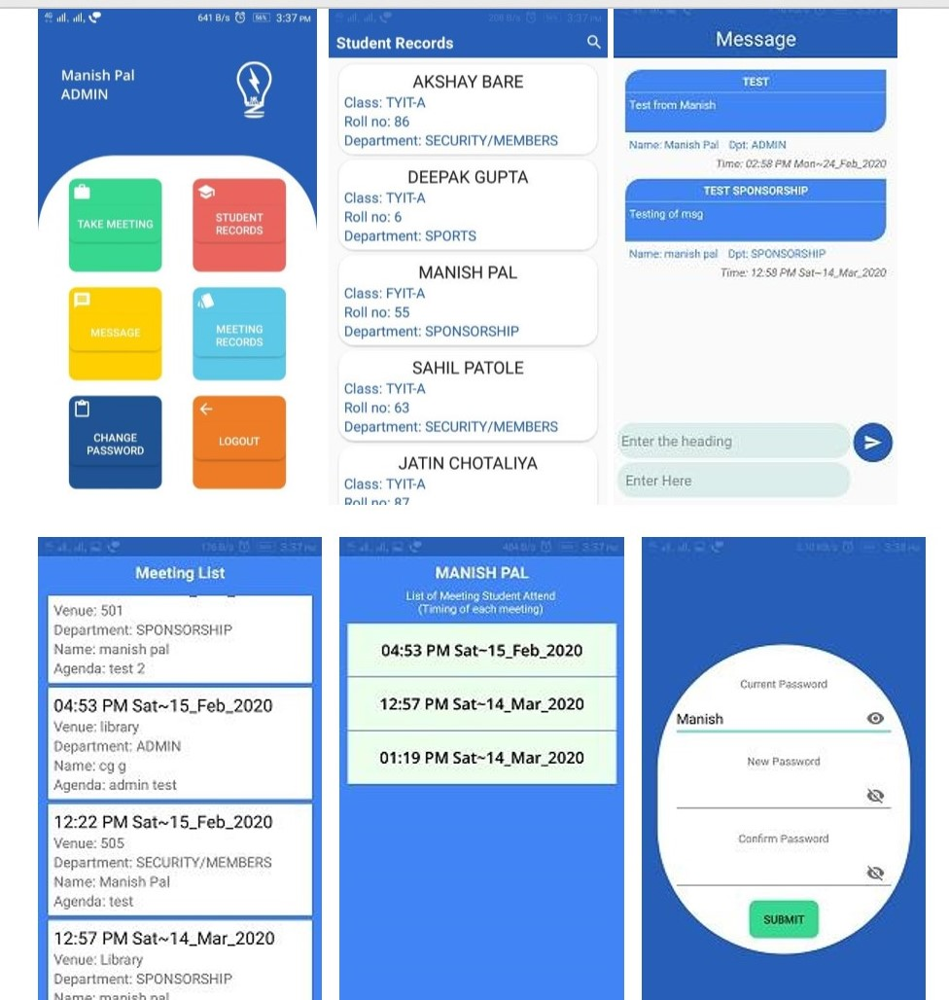
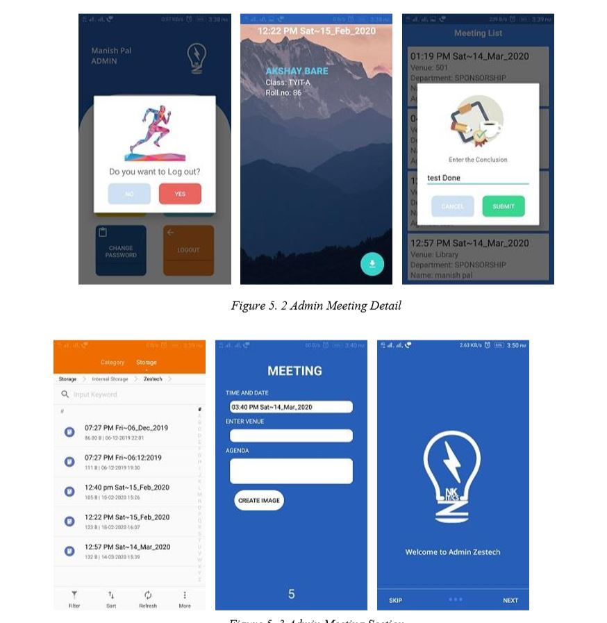
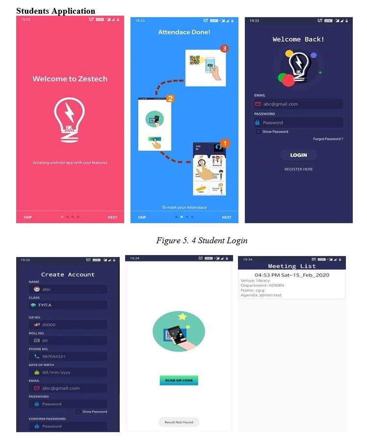
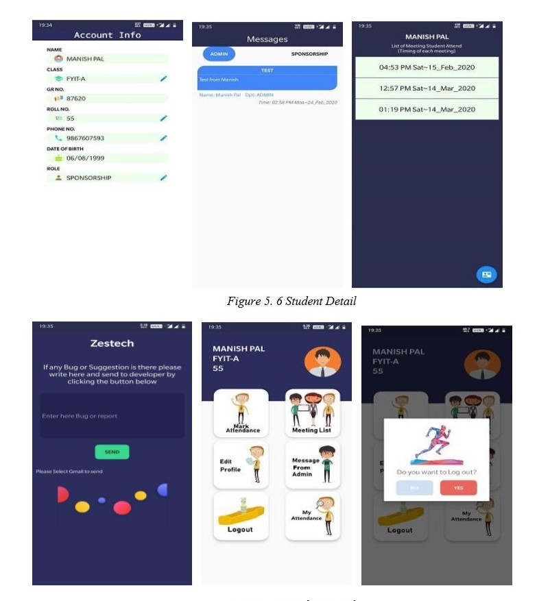

# Attendance-App with Firebase database
there is 2 app one for Admin( Admin-Zestech) and another for student (Zestech)
# Admin-Zestech 
Admin Application of Attendance App name Zestech

Admin app  generates the QR Code by entering the meeting details and Students use the second application for giving the attendance by Scanning the QR Code.
 Zestech app deals with the maintenance of the student's attendance details. 
It generates the attendance of the student on the basis of presence in meetings .

Things that admin can do
1) Generate Qr-code
2) See student data
3) Message to Students
4) See Meeting Records and add conclusion to it.
5) Download the Excel file of each meeting
6) See individual meeting list 

# Zestech (Student app)

